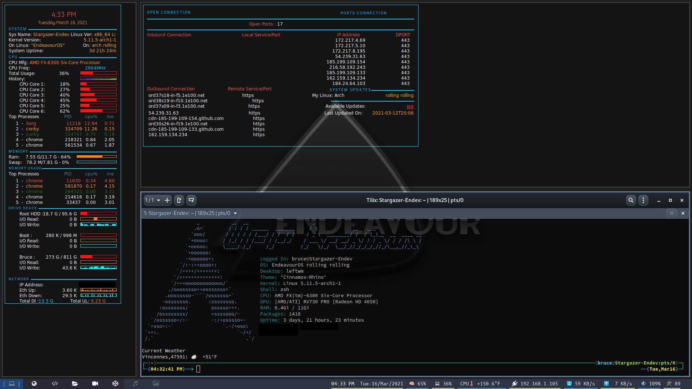
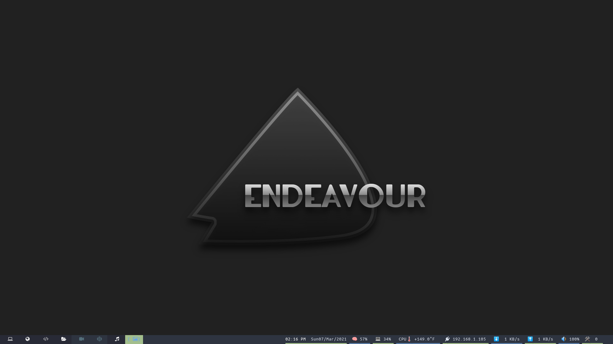
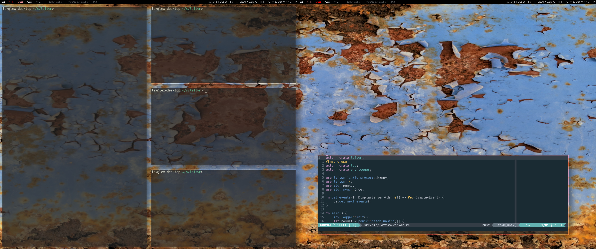

## Welcome to my LeftWM-SpectrWM Window Manager Setup.

### (Use At Your Own Risk)





Here you will find my Dot Files and Scripts I use for my LeftWM / SpectrWM setup that I use on my EndeavourOS Arch install...
I also use these on my Linux Mint, my BTW Arch, MX 19 and others when I get a chance...
Some of these files were borrowed from OTB, DT, Linux Dabbler and other sources. I don't remember where I got them all
but here they are! I know some of the script might not be worded right adn I am not a programer by anymeans but they work for me.
Edit them as you wish... Make then work for you!
I have included all my ~/bin files for plublic use. Also my Polybar, Rofi, and other files, my config file, Thenes build files.. Enjoy!

```
One thing I found useful is to search through the LeftWm (Issues) Bug Reports. I found some good
information that was and is not in the Wiki.
So make sure you check there. Also there's lots of good help on the Github site...
Also you should use YAY (or you fav AUR tool) and download the leftwm-git version. I was told
by the Devs. This is updated with all the patches often. Give it a try! I will...
```
I have found some things that were not in the LeftWm Wiki...
I got them from the (Issues) Bug Reports and they fixed some of my issues.
I fmund this below Bindings in a Report. Then later found in the Wiki, I was looking to hard.
```
[[keybind]]
command = "FocusNextTag"
modifier = ["modkey"]
key = "Right"

[[keybind]]
command = "FocusPreviousTag"
modifier = ["modkey"]
key = "Left"
```

With these I can use the arrow keys and it works just like in SpectrWm where you hold down the Modkey
and use the arrow keys to move between the tags!
This was a must for me. If you like to use the Vim keys just change the "KEY = "J"" or to what evr you want.

Now I had some screen resolution issue and I had to file a (Issues) Bug Report.
The Dev, an 2 theres jumped right in on the Bug Report and had me fixed within few days of texting back and forth.

 I got LeftWm all sorted.. Took a bit of work and a bunch of chatting on the Github (Issues)Bug Report but thanks for the Great folks over there we got things working...
The polybar was easy. I figured that one out. I looked at othere Themes that had the bar on the bottom and found out how they did that
There is a setting you change and it is on the bottom... Like this
```
To Put the polybar at the bottom of the screen. The default is bottom = false
bottom = true    <--- Set it to this for the bottom bar.
```

The desktop was a 4 day message back and forth / testing and the great help I got was fantastic!
LeftWm desktop would not go into 1920x1080 and stayed stuck in 1360x768. Arch's default boot this monitor / Tv at 1360x768 and EndeavourOS changes it to 1920x1080 on booting into Cinnamon.
Logging into LeftWm you don't have that and there are things one needs get the resolution set right. Most folks have a xorg.conf I guess, that deals with that but AMD does not have any setup tool for Linux so ya have to do things manually.
When I set the display with xrandr LeftWm would change but the desktop is all squished into the upper left of the screen.

In the end to fix my issue after 4 days. They had me created a ".xprofile" and added the xrandr commands in there...
This is the commands that I used for my Monitor / Tv...
```
xrandr --output VGA-0 --off --output DVI-0 --off --output HDMI-0 --primary --mode 1920x1080 --pos 0x0 --rotate normal
```

Now LeftWm boots into 1920x1080 and all is right as rain! :-D
As a added Bonus, SpectrWm uses .xprofile too and the resolutionwas fixed there too. That ment I could do away with 2 scripts that I was using for Spectrwm to get the resolution set, so Yall.. Things are great!
I hope this may help anyone else that has these issues... :-)

So that is some of the things I had fun with and yes it was a adventure! Lol


## Please READ the rest of this Readme as it mostly came from LeftWM Github README.md
Please install all the Dependencies and programs, Themes. Most of all follow the instruction on the Themes to make the Links to the folders.
That is it! Have fun!
Thanks LeftWm Devs for such a cool Window Manger!


# LeftWM - A window manager for Adventurers




# Table of contents

- [Why go left](#why-go-left)
- [Dependencies](#dependencies)
- [Installation (with package manager)](#installation-with-package-manager)
- [Manual Installation (no package manager)](#manual-installation-no-package-manager)
  - [Using a graphical login such as LightDM, GDM, LXDM, and others](#using-a-graphical-login-such-as-lightdm-gdm-lxdm-and-others)
  - [Starting with startx or a login such as slim](#starting-with-startx-or-a-login-such-as-slim)
- [Theming](#theming)
  - [With LeftWM-Theme](#with-leftwm-theme)
  - [Without LeftWM-Theme](#without-leftwm-theme)
- [Configuring](#configuring)
  - [Default keys](#default-keys)
  - [Workspaces](#workspaces)
  - [Tags / Desktops](#tags--desktops)
  - [Layouts](#layouts)
- [Troubleshooting](#troubleshooting)


# Why go left

Left is a tiling window manager written in [Rust](https://github.com/rust-lang/rust) that aims to be stable and performant. Left is [designed to do one thing and to do that one thing well](https://en.wikipedia.org/wiki/Unix_philosophy#Do_One_Thing_and_Do_It_Well): _be a window manager_. Left therefore follows the following mantra:

> Left is not a compositor.  
> Left is not a lock screen.  
> Left is not a bar. But, there are lots of good bars out there. With themes, picking one is as simple as setting a symlink.

Because you probably want more than just a black screen, LeftWM is built around the concept of themes. With themes, you can choose between different bars, compositors, backgrounds, colors, docks, and whatever else makes you happy.

LeftWM was built from the very beginning to support multiple screens and ultrawide monitors. The default keybindings support ultrawide monitors and multiple screens.

## One of the core concepts/features of LeftWM is theming

With LeftWM, there are two types of configuration files:

- **LeftWM Configuration files:** LeftWM configurations are specific to you and don’t change for different themes. These are settings like keybindings, workspace locations, and names of desktops/tags. These settings can be found in `~/.config/leftwm/config.toml`.

- **Theme Configuration files:** The appearance of your desktop is different. It’s fun to try new looks and feels. It’s fun to tweak and customize the appearance (AKA: [ricing](https://www.reddit.com/r/unixporn/comments/3iy3wd/stupid_question_what_is_ricing/)). It’s fun to share so others can experience your awesome desktop! LeftWM is built around this concept. By pulling all these settings out into themes, you can now easily tweak, switch, and share your experiences. This configuration is spread between `theme.toml` and related files contained within a theme's folder.

# Dependencies

While LeftWM has very few dependencies, this isn't always the case for themes.
Themes typically require the following to be installed. However, this is up to the
author of the theme, and could be different.

List of LeftWM dependencies:  

- xorg (libxinerama, xrandr, xorg-server)  
- bash
- rust  

List of common dependencies for themes:

| Dependency<br>(git)| Ubuntu 20.4.1<br> _sudo apt install {}_  | Arch<br> _sudo pacman -S {}_  | Fedora 33<br> _sudo dnf install {}_  | PKGS  |
|- |- |- |- |- |
| [feh](https://github.com/derf/feh)  | feh  | feh  | feh  | [feh](https://pkgs.org/search/?q=feh&on=provides)  |
| [compton](https://github.com/chjj/compton)  | compton  | yay -S picom*  | compton  | [compton](https://pkgs.org/download/compton)  |
| [picom](https://github.com/yshui/picom)  | manual **  | picom  | picom  | [picom](https://pkgs.org/download/picom)  |
| [polybar](https://github.com/polybar/polybar)  | manual **  | yay -S polybar*  | polybar  | [polybar](https://pkgs.org/download/polybar)  |
| [xmobar](https://github.com/jaor/xmobar)  | xmobar  | xmobar  | xmobar  | [xmobar](https://pkgs.org/download/xmobar)  |
| [lemonbar](https://github.com/LemonBoy/bar)  | lemonbar  | yay -S lemonbar*  | manual **  | [lemonbar](https://pkgs.org/download/lemonbar)  |
| [conky](https://github.com/brndnmtthws/conky)  | conky  | conky  | conky  | [conky](https://pkgs.org/download/conky)  |
| [dmenu](https://git.suckless.org/dmenu)  | dmenu  | dmenu  | dmenu  | [dmenu](https://pkgs.org/download/dmenu)  |

> \* You can use whichever AUR wrapper you like  
> \*\* See the git page (link in first column) for how to install these manually

# Installation (with package manager)

LeftWM is available in the AUR as well as crates.io. Both are good options for simple installation. If you install LeftWM with crates.io, you will need to link to the xsession desktop file if you want to be able to login to LeftWM from a graphical login screen:

```bash
sudo cp PATH_TO_LEFTWM/leftwm.desktop /usr/share/xsessions
```

LeftWM is also available in Fedora [Copr](https://copr.fedorainfracloud.org/coprs/atim/leftwm/):

```bash
sudo dnf copr enable atim/leftwm -y && sudo dnf install leftwm
```

# Manual Installation (no package manager)

## Using a graphical login such as LightDM, GDM, LXDM, and others

1) Copy leftwm.desktop to /usr/share/xsessions
2) Create a symlink to the build of leftwm so that it is in your path:

```bash
cd /usr/bin
sudo ln -s PATH_TO_LEFTWM/target/debug/leftwm
sudo ln -s PATH_TO_LEFTWM/target/debug/leftwm-worker
sudo ln -s PATH_TO_LEFTWM/target/debug/leftwm-state
sudo ln -s PATH_TO_LEFTWM/target/debug/leftwm-check
```

and

```bash
sudo cp PATH_TO_LEFTWM/leftwm.desktop /usr/share/xsessions
```

You should now see LeftWM in your list of available window managers.

## Starting with startx or a login such as slim

Make sure this is at the end of your .xinitrc file:

```bash .xinitrc
exec dbus-launch leftwm
```

# Theming

If you want to see more than a black screen when you login, select a theme:

## With [LeftWM-Theme](https://github.com/leftwm/leftwm-theme)

```bash
leftwm-theme update
leftwm-theme install NAME_OF_THEME_YOU_LIKE
leftwm-theme apply NAME_OF_THEME_YOU_LIKE
```

## Without [LeftWM-Theme](https://github.com/leftwm/leftwm-theme)

```bash
mkdir -p ~/.config/leftwm/themes
cd ~/.config/leftwm/themes
ln -s PATH_TO_THE_THEME_YOU_LIKE current
```

LeftWM comes packaged with a couple of default themes. There is also a [community repository for sharing themes](https://github.com/leftwm/leftwm-community-themes)

For more information about themes check out our theme guide [here](https://github.com/leftwm/leftwm/tree/master/themes) or the wiki [here](https://github.com/leftwm/leftwm/wiki/Themes).

# Configuring

The settings file to change key bindings and the default mod key can be found at

```bash
~/.config/leftwm/config.toml
```

## Default keys

```bash
Mod + (1-9) => Switch to a desktop/tag
Mod + Shift + (1-9) => Move the focused window to desktop/tag
Mod + W => Switch the desktops for each screen. Desktops [1][2] changes to [2][1]
Mod + Shift + W => Move window to the other desktop
Mod + (⬆️⬇️) => Focus on the different windows in the current workspace
Mod + Shift + (⬆️⬇️) => Move the different windows in the current workspace
Mod + Enter => Move selected window to the top of the stack in the current workspace
Mod + Ctrl + (⬆️⬇️) => Switch between different layouts
Mod + Shift + (⬅➡) => Switch between different workspaces
Mod + Shift + Enter => Open a terminal
Mod + Ctrl + L => Lock the screen
Mod + Shift + X => Exit LeftWM
Mod + Shift + Q => Close the current window
Mod + Shift + R => Reload LeftWM and its config
Mod + p => Use dmenu to start application
```

## Workspaces

By default, workspaces have a one-to-one relationship with screens, but this is configurable. There are many reasons you might want to change this, but the main reason is for ultrawide monitors. You might want to have two or even three workspaces on a single screen.

Here is an example config changing the way workspaces are defined (~/.config/leftwm/config.toml)

```toml
[[workspaces]]
y = 0
x = 0
height = 1440
width = 1720

[[workspaces]]
y = 0
x = 1720
height = 1440
width = 1720
```

## Tags / Desktops

The default tags are 1-9. They can be renamed in the config file by setting the
list of tags.

Here is an example config changing the list of available tags. NOTE: tag navigation (Mod + #) doesn't change based on the name of the tag

```toml
tags = ["Web", "Code", "Shell", "Music", "Connect"]
```

## Layouts

By default, all layouts are enabled. There are a lot of layouts so you might want to consider only enabling the ones you use. To do this add a layout section to your config.toml file. This enables only the layouts you specify 

Example:
```toml
layouts = ["MainAndHorizontalStack", "GridHorizontal", "Fibonacci", "EvenVertical", "EvenHorizontal", "CenterMain"]
```

[More detailed configuration information can be found in the Wiki](https://github.com/leftwm/leftwm/wiki/Config).

## LeftWM is [EWMH](https://en.wikipedia.org/wiki/Extended_Window_Manager_Hints) compliant

The default layouts are [all of the kinds](src/layouts/mod.rs#L16) described by the Layout enum.

## Troubleshooting

| Issue | Description | Solution |
|-|-|:-:|
| LeftWM not listed by login manager | It's likely you need to add the xsessions file to the right folder. | See [installation](#installation-with-package-manager) |
| No config.toml file exists | LeftWM does not always ship with a `config.toml`. You will need to execute LeftWM at least once for one to be generated. | Try the following: ``` leftwm-worker ``` |
| Config.toml is not being parsed | LeftWM ships with a binary called leftwm-check. It might not be installed by the AUR. | Try the following: ``` leftwm-check ``` |
| Keybinding doesn't work | It's likely you need to specify a value or have a typo. | See Wiki |
